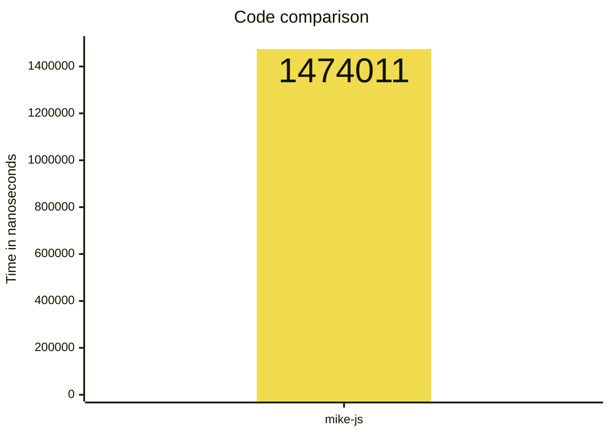

# js-faster-than-rust

This repo is to support an article on the posidevely website.

We take the input (shown in [input.txt](./input.txt)) and find the first 14 unique characters in the string.

We write some optimised code in different languages to see how they compare.

```mermaid
---
config:
    xyChart:
        showDataLabel: true
    themeVariables:
        xyChart:
            plotColorPalette: "#F7A41D,#F0DB4F, #CE422B"
---
xychart-beta
    title "Code comparison"
    x-axis [benny-rs, david-rs, chris-rs, chris-zig, chris-js]
    y-axis "Time in nanoseconds" 0 --> 100000
    bar [-10000, -10000, -10000, 18000, -10000]
    bar [-10000, -10000, -10000, -10000, 2113]
    bar [90000, 55000, 48000, -10000, -10000]
```





## js

    - `cd js`
    - `node --allow-natives-syntax chris.js`
    - `node --allow-natives-syntax mike.js`

## rust

    - `cd rust`
    - `rustc benny.rs`
    - `./benny`
    - `rustc chris.rs`
    - `./chris`
    - `rustc david.rs`
    - `./david`

## zig

This did need a symlink to work but hopefully should work ok for you.

    - `cd zig`
    - `zig run chris.zig`


# Combinations

```sh
node --max-old-space-size=24576 combinations.js
```

TODO Refactor this to use 32bit number
