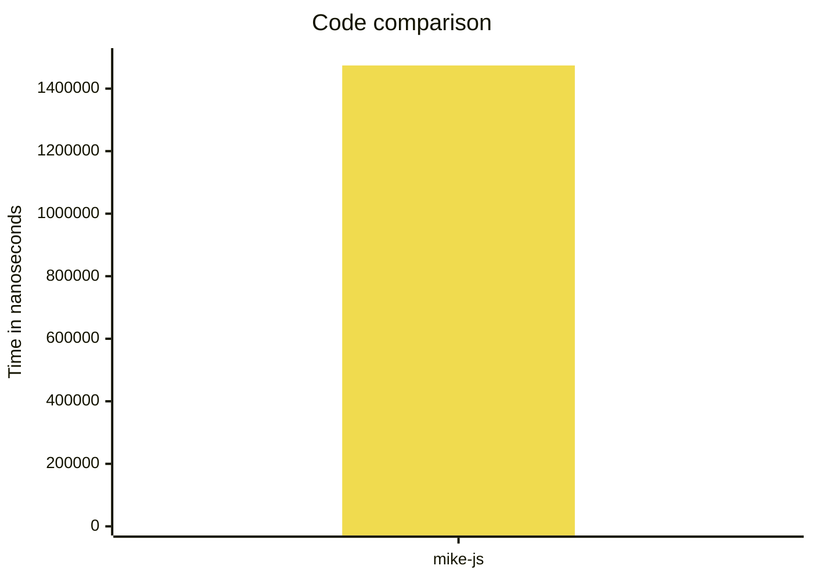

# js-faster-than-rust

This repo is to support an article on the posidevely.com website.

We take the input (shown in [input.txt](./input.txt)) and find the first 14 unique characters in the string.

We write some optimised code in different languages to see how they compare.

## Code

### js

    - `cd js`
    - `node --allow-natives-syntax chris.js`
    - `node --allow-natives-syntax mike.js`

#### Chris JS

This is an optimised version as per the article, it is surprisingly fast!, see the article for more.

#### Mike JS

This is an example from Mike Bostock, see the article for more.

### rust

    - `cd rust`
    - `rustc benny.rs`
    - `./benny`
    - `rustc chris.rs`
    - `./chris`
    - `rustc david.rs`
    - `./david`

#### Benny RS

This is an example from Benny, see the article for more.

#### Chris RS

This is an optimised version as per the article, see the article for more.

#### David RS

This is an example from David, see the article for more.

### zig

    - `cd zig`
    - `zig run chris.zig`

This is a zig version, it is pretty fast too!

### Results

```mermaid
---
config:
    themeVariables:
        xyChart:
            plotColorPalette: "#F7A41D,#F0DB4F, #CE422B"
---
xychart-beta
    title "Code comparison"
    x-axis [benny-rs, david-rs, chris-rs, chris-zig, chris-js]
    y-axis "Time in nanoseconds" 0 --> 100000
    bar [-10000, -10000, -10000, 18000, -10000]
    bar [-10000, -10000, -10000, -10000, 2113]
    bar [90000, 55000, 48000, -10000, -10000]
```





## Combinations

Just some code to calculate the number of combinations.

```sh
node combinations.js
```
