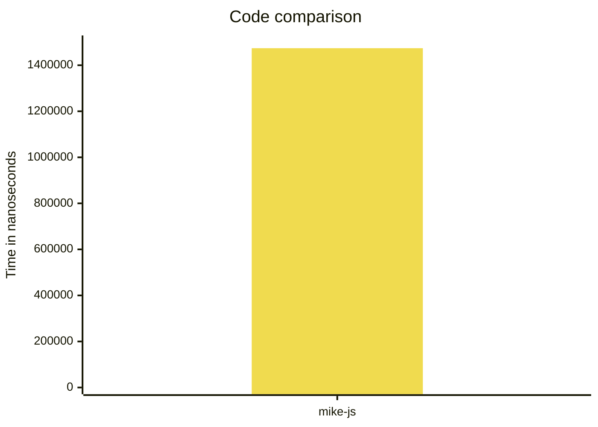

# js-faster-than-rust

It isn't but it is damn close!

This repo is to support an article on the posidevely.com website.

We take the input (shown in [input.txt](./input.txt)) and find the first 14 unique characters in the string.

We write some optimised code in different languages to see how they compare.

## Code

### js
    - `cd js && node --allow-natives-syntax chris.js && cd -`
    - `cd js && node --allow-natives-syntax mike.js && cd -`

#### Chris JS

This is an optimised version as per the article, it is surprisingly fast!, see the article for more.

#### Mike JS

This is an example from Mike Bostock, see the article for more.

### rust

    - cd rust && rustc -O benny.rs && ./benny
    - cd rust && rustc -O chris.rs && ./chris
    - cd rust && rustc -O david.rs && ./david

#### Benny RS

This is an example from Benny, see the article for more.

#### Chris RS

This is an optimised version as per the article, see the article for more.

#### David RS

This is an example from David, see the article for more.

### zig

    - `cd zig && zig run -O ReleaseFast -lc --sysroot $(xcrun --show-sdk-path) chris.zig`

This is a zig version, it is pretty fast too!

### c

    - `cd c && gcc -O2 chris.c -o chris && ./chris`

### Results


```mermaid
---
config:
    themeVariables:
        xyChart:
            plotColorPalette: "#F0DB4F"
---
xychart-beta
    title "Code comparison"
    x-axis [mike-js]
    y-axis "Time in nanoseconds" 0 --> 1500000
    bar [1474011]
```


```mermaid
---
config:
    themeVariables:
        xyChart:
            plotColorPalette: "#F7A41D, #F0DB4F, #CE422B, #555555"
---
xychart-beta
    title "Code comparison"
    x-axis [benny-rs, david-rs, chris-js, chris-zig, chris-rs, chris-c]
    y-axis "Time in nanoseconds" 0 --> 5000
    bar [-10000, -10000, -10000, 850, -10000, -10000]
    bar [-10000, -10000, 1449, -10000, -10000, -10000]
    bar [2024, 565, -10000, -10000, 879, -10000]
    bar [-10000, -10000, -10000, -10000, -10000, 770]
```

## Combinations

Just some code to calculate the number of combinations.

```sh
node combinations.js
```
